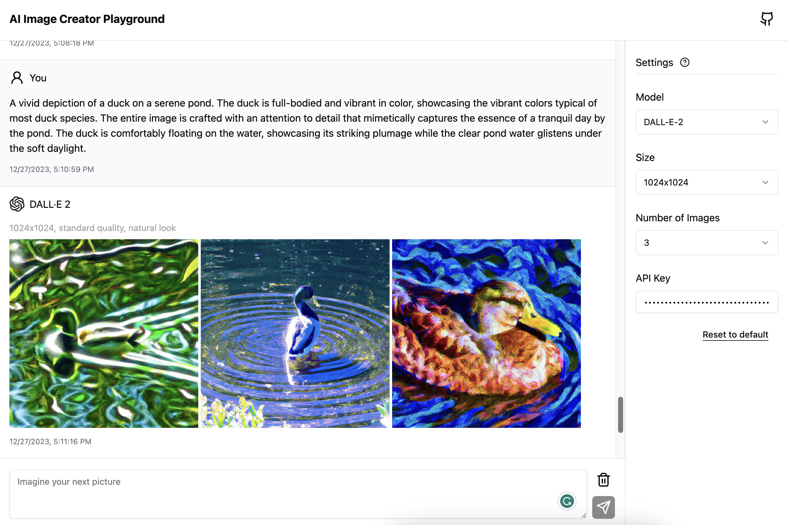

# AI Image Creator Playground folked from [Quilljou DALL·E 3 Playground](https://github.com/Quilljou/dalle3-playground)

DALL·E Playground (Unofficial) is used to play with OpenAI Image generation API 
- [DALL·E 3](https://openai.com/dall-e-3)
- [DALL·E 2](https://openai.com/dall-e-2)

You must use your own [OpenAI API Key](https://platform.openai.com/account/api-keys)



[Live Preview](https://generator-hub.vercel.app/)


## Features

- [x] Support both Dall⋅E 2 and Dall⋅E 3
- [x] Generate multiple variants (Dall⋅E 2 only)
- [x] Chat to generate images
- [x] Persistent data
- [x] Responsive UI
- [x] Cancel generation
- [x] Error Handling
- [ ] Imprinting image (todo)
- [ ] Outprinting image (todo)

## Dev

```sh
pnpm install
pnpm dev
```

